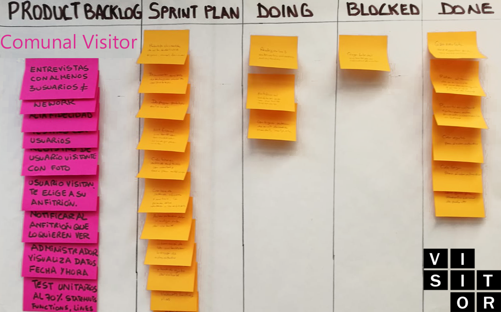
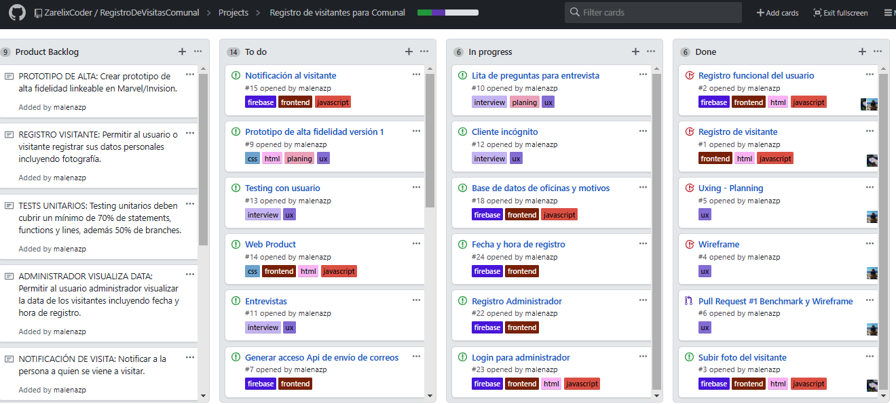
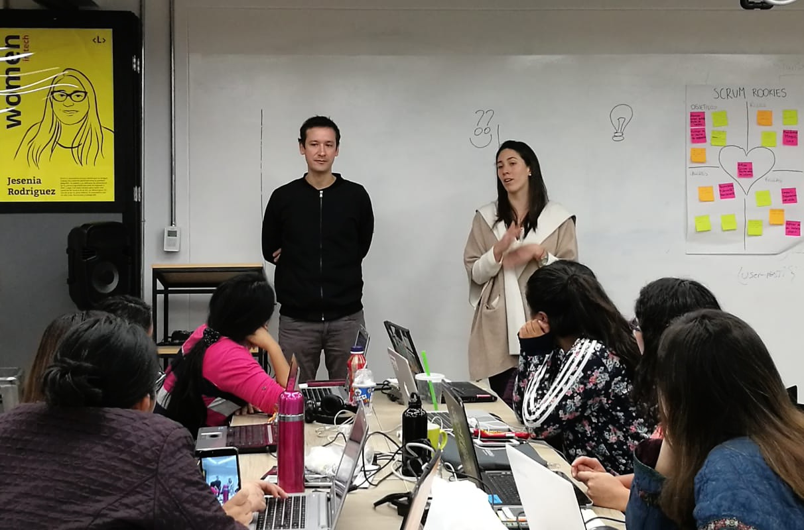

#  COMUNAL•VISITOR - Registro de visitas

## 1. Introducción:
Comunal es un espacio de coworking que ofrece a sus clientes de distintos tipos de emprendimiento como startups, freelancers y pequeñas empresas, ambientes para poder trabajar con una cultura de comunidad y colaboración; es por este motivo que las oficinas de Comunal son diariamente visitadas por una gran cantidad de personas, no sólo colaboradores de las empresas, sino también invitados, postulantes y personal externo. En este contexto, el registro de todas estas personas es realizado por el personal de seguridad y/o recepción de forma manual, pidiendo su documento de identidad, apuntando con papel y lápiz la información de dicho visitante y avisando por anexo telefónico al receptor.

El presente proyecto COMUNAL•VISITOR, busca crear un registro de visitas digital para  © Comunal Coworking, de forma que sea más competitiva frente a nuevas propuestas del mismo rubro en el mercado como [WeWork](https://www.googleadservices.com/pagead/aclk?sa=L&ai=DChcSEwilrK_T5KjcAhWCj7MKHexzAEgYABAAGgJxbg&ohost=www.google.cl&cid=CAASE-RoAxXTp1Cd0ErxEHpPSGuF4Hk&sig=AOD64_38ykNPf0QRtI9n4CFtpQpth-MrNQ&q=&ved=0ahUKEwjswKvT5KjcAhVkU98KHUcYCeMQ0QwIJA&adurl=) o también comparándola con [Envoy](https://envoy.com/) de EEUU que ofrece un servicio de sistema digital de registro de visitantes.

## 2. Proceso de planeamiento:
La fase inicial de planeamiento involucra la utilización del método Kanban para tener un control del avance del proyecto de forma incremental detallado en el Product Backlog:

Del mismo modo utilizamos el recurso de desarrollo de proyecto de GitHub según el método Kanban que es visible la [Opción projects del repositorio](https://github.com/ZarelixCoder/RegistroDeVisitasComunal/projects/1).

Para completar el proyecto nos organizamos como un equipo multifuncional de tres developers, la estructura que se asumió es de una Ux Designer y dos Front-ends, liderando áreas específicas de trabajo: 
* UX Designer
    Encargada de diseñar la experiencia de la aplicación, identificar, documentar y priorizar las historias de usuario y finalmente crear el diseño visual de la interfaz.
* Front-end Developers
    Encargadas de implementar la interfaz de usuario diseñada (HTML/CSS/JS) e incluir pruebas unitarias de todos los desarrollos.

## 3. UX Design:

### 3.1. Análisis de referencias: 

Podemos visualizar el formato rápido de registro de visitas de [Envoy Vs WeWork](https://drive.google.com/open?id=1dC-2Jw7iOuWt_JDhFzWEzz_oAnUsxxCP), donde verificamos que Envoy da la posibilidad al usuario de crear un registro personal para cada empresa que labora en sus instalaciones y el visitante genera una solicitud especificando la fecha, hora y host que lo atenderá. Nuestra aplicación está inspirada en ambos modelos y tomamos las funcionalidades que más se ajustaban a nuestras necesidades. 

### 3.2 Benchmarking:
Nuestra aplicación tiene las mismas facultades de usabilidad y accesibilidad, es adaptable a los diferentes dispositivos y de fácil utilización.
El diseño es sencillo, enfocado en los colores del branding de  © Comunal Coworking y el diseño cúbico del logo institucional que utilizan.
Nos enfocamos en dos tipos de usuarios, tanto el visitante como el administrador que puede registrarse y generar una cuenta para validar las visitas.
Las funciones tienen fácil acceso y están detalladas por nombre de proceso que debe realizar cada input de ingreso de información y botón.

### 3.2. Prototyping:

#### 3.2.1. Wireframe:
Diseñamos un [Wireframe inicial](http://subirimagen.me/uploads/20180805130948.png) como guía principal para el desarrollo del producto, consta de cuatro vistas:
* Una primera que incluye botones con las opciones de: Registro de visitante, Verificador de estado de visita y el modo administrador.
* Una segunda con la pantalla de registro de datos del visitante, detalles de la oficina a visitar, nombre de anfitrión, motivo de visita y opción de subir fotografía.
* Una tercera con la pantalla de verificador de estado de visita, donde el solicitante puede validar si su anfitrión aceptó la visita programada.
* Una cuarta con la opción de modo administrador para verificar los ingresos y salidas diarios de visitantes por parte del personal autorizado de © Comunal Coworking.

#### 3.2.2. Prototipo de alta fidelidad:

Diseñamos un [Primer prototipo de alta fidelidad](https://www.figma.com/proto/EITo8LvGio9YhdiZChqBtx9h/Comunal-Visitor?node-id=5%3A130&scaling=scale-down) de acuerdo al análisis de referencias y resultados comparativos obtenidos en el proceso de beanchmarking:
* Cuenta con 12 vistas partiendo de la pantalla principal donde el usuario tiene la posibilidad de elegir entre la opción visitante u opción administrador.
* De la pantalla 2 a la 6 es el registro del visitante, complentando los siguientes datos: Nombres, apellidos, DNI, oficina a visitar, anfitrión que lo recibirá, e-mail y fotografía que podrá ser tomada del mismo dspositivo desde donde abrió la aplicación. Finalmente se le informa al visitante que debe esperar la confirmación de su anfitrión al correo electrónico que proporcionó.
* De la pantalla 7 a la 12 se accede a la opción de Administrador, donde el personal seguridad del edificio y de recepción de Comunal tendrá la posibilidad de registrar un usuario administrador, loguearse y visualisar la data de visitantes con opción a filtrar por nombre de visitante y/o oficina.

#### 3.2.3. Testing de usuario con prototipo:

El usuario testeado identifica la simplicidad del producto, aunque advierte la suceptibilidad del filtro de seguridad al permitir el registro libre de administradores para loguearse y obtener la información de los visitantes, detalla que en la pantalla de administrador que el filtro por nombre de visitante no es necesario y basta con el filtro por oficina visitada, al su vez, en la solicitud de visita si es que se solicita un correo al visitante, este debería ser utilizado para notificarle sobre la recepción de su solicitud y posterior confirmación.

### 3.3. Entrevistas:

#### 3.3.1. Relación de preguntas hacia la administración:

1. ¿Cuántas empresas laboran dentro de la sede de Comunal Barranco?
2. ¿Cuántas visitas reciben en total diariamente?
3. ¿Cuáles son los datos que solicitan a los visitantes?
4. ¿Cómo es el proceso de registro de visitante?
5. ¿Cómo logran alinearse con la administración del edificio?
6. Respecto a otras empresas de Coworking que ofrecen un registro digital que visitas, ¿Cuál es su opinión?
7. Respecto a la pregunta dos, ¿Porqué aún mantienen el sistema de registro manual de gestión de visitas?
8. ¿Además de pedir el nombre del visitante, no consideran importante solicitar otro tipo de información adicional para poder tener un estudio más a fondo de las personas que ingresan a sus instalaciones?

#### Entrevita 1 y 2 : Diego e Ivanna de la administración de © Comunal Coworking:

#### Respuestas:

1. Dentro de Comunal Barranco existen 52 empresas desde las más pequeñas a las más grandes que operan en distintos horarios.
2. Diariamente recibimos un promedio de 50 visitas diarias entre todos los ambientes y comuneros (nombre con el que se denomina a las personas que laboran dentro de las instalaciones de Comunal) que atienden a estas personal.
3. Los datos solicitados son únicamente su nombre y DNI.
4. El proceso de registro pasa por dos filtros: Inicialmente pasan por administración del edificio que está al ingreso donde les solcitan llenar sus datos: Nombre, DNI y Firma en una hoja de registro, después pasan a la oficina 107 donde está la recepción de Comunal desde donde los derivamos a la oficina correspondiente.
5. Lo ideal es no repetir tareas para no darle una mala experiencia al visitante, por lo tanto en el segundo filtro de nuestra recepción no le pedimos que complete nuevamente un registro, sino que solicitamos su nombre y nos comunicamos con la oficina y/o anfitrión que vaya a atenderlo, en primera instancia por el servicio de whatsapp y en segunda instancia al anexo telefónico.
6. Parte del espíritu de marca de Comunal está en la atención humana personalizada, no queremos perder esa calidez que definitivamente se reduce al incorporar sistemas íntegramente digitales en empresas com We-work.
7. Nosotros procuramos mantener la gestión de todo tipo de procesos de nuestros comuneros por nuestra cuenta, para que ellos se concentren sólo en trabajar, de este modo queremos darles todas las facilidades posibles incluído el trato amable, humano y directo a sus visitantes.
8. Eso sí sería lo ideal, poder tener datos como su hora de ingreso y salida, poder calcular cuál es la empresa de nuestro coworking que recibe más visitas y tener alguna forma de contactar al visitante. Pero algo que no consideramos necesario es preguntarle el motivo de su visita, pues ese tema es un poco invasivo.

#### 3.3.2. Relación de preguntas hacia el anfitrión:

1. ¿Cuántas visitas recibes en promedio mensualmente?
2. ¿Respecto a esos visitantes, qué porcentaje son personas totalmente nuevas?
3. ¿Qué tipo de información de esas personas nuevas te gustaría que se almancene?
4. ¿Si una persona externa a Laboratoria quiere visitarte qué es lo que debes hacer para permitirle el ingreso?
5. ¿Alguna vez haz tenido algún inconveniente con el ingreso de una visita?
6. Respecto a otras empresas de Coworking que ofrecen un registro digital que visitas, ¿Cuál es su opinión?
7. Respecto a la pregunta anterior, Comunal Coworking espera no perder la parte del contacto humano al recibir a una persona y por eso no implementa sistemas de registro digitales, ¿Respecto a eso, qué opinas?
8. ¿Si Comunal implementara un sistema de registro digital de sus visitas, cómo te gustaría que fuese el proceo?

#### Entrevita 3: Beatriz Castiglia de Laboratoria, empresa que labora dentro de Comunal:

#### Respuestas:

1. Normalmente Laboratoria recibe muchas visitas, pero yo particularmente recibo alrededor de 3 externos mensualmente.
2. Las personas recurrentes que proveen servicios son muy constantes, pero existen varias personas nuevas que vienen a visitarnos, son esas 3 que menciono.
3. No es necesario saber más información fuera de su nombre y DNI, pues lo demás lo charlamos personalmente y es común que con anticipación sepamos el motivo de la visita.
4. Tengo que avisar a Comunal y Comunal avisa al edificio, hay ocasiones donde pasa directamente si ya se ha informado de su llegada, además tenemos un grupo de whatsapp de Laboratoria con Comunal, ahi nos escriben e informamos como procedemos.
5. Nunca he tenido un inconveniente con una visita.
6. Creo es mucho más útil, una vez pedí que me dieran un estacionamiento para un visitante, y el registro era muy complicado, tedioso y sin sentido. Poco eficiente.
7. Es totalmente acertado, me encanta poder realizar aplicaciones pero no necesariamente funciona. Por esto debe haber un punto intermedio entre la tecnología y el contacto humano.
8. Simple y sencillo, no me gusta cuando algo se vuelve muy complicado por las puras, la actitud que te recibe pesa mucho y también disposición para atenderte.

### 3.4. Cliente incógnito:

Como visualizamos en el punto 3.1. de WeWork Vs Envoy, decidimos hacer probar el registro y métodos de solicitud de visita de [We Work en otros países](https://drive.google.com/file/d/1sheXw97VrbkRFlHYp82YT2uNfVc6fvt2/view?usp=sharing) y resolvimos el siguiente análisis:

* We Work es una empresa de Coworking súmamente digitalizada que hace una gran cantidad de procesos en los distintos servicios que ofrece su plataforma, la cual también tiene una aplicación disponible para android y IOS.
* Su registro y solicitud de visita, te permite agendar no sólo para conocer las instalaciones, contratar oficinas, hablar sobre una membresía ya existente, sino también una opción de otros que permite al usuario abarcar otras posibilidades fuera del abanico ofrecido por la plataforma.
* La necesidad de solicitar además del nombre de solicitante, el nombre de la compañía, es debido a la analítica que poseen y revisan para un estudio de mercado más eficiente y así potencializar sus procesos de expansión.
* También se solicita tanto el correo electrónico como el número de teléfono para tener más de un medio de contacto en caso uno de ellos falle.
* Finalmente la opción de notas permite especificar más allá de las casillas de opciones qué es lo que necesita el usuario.

### 3.5. Conclusiones de la investigación:

De acuerdo a la investigación concluímos la necesidad de implementar un sistema de solicitud de visitas para el usuario, más allá de un registro digital dentro de las mismas instalaciones de Comunal, esto quiere decir que planteamos que el visitante pueda acceder a la web de Comunal•Visitor, o incluso estar esta opción insertada en su misma página web, para poder procesar una solicitud de visita desde la comodidad de su hogar en su computador o en cualquier lugar desde su dispositivo móbil y esperar la confirmación de día y hora por parte de su anfitrión, de este modo se evitarían los tiempos de espera, el personal en administración ya tendría una agenda detallada de todas las visitas que llegarán en el día y podría hacerlas pasar directamente validando únicamente los datos de su registro con su DNI.

### 3.6 Problemas identificados:

Los problemas identificados los detallamos en la siguiente lista:

* Existen dos filtros para el ingreso de visitantes a las instalaciones de Comunal en Barranco, uno es el filtro de seguridad del edifico y otro es el filtro de recepción de Comunal, lo cual muchas veces genera una duplicación de tareas y tiempos de espera más largos para el visitante que quiere acceder a una oficina por un motivo en particular.
* La forma de comunicación al anfitrión se da por whastapp la cual no es muy efectiva pues no siempre el anfitrión está atento a su teléfono móbil.
* La segunda forma de comunicación es el anexo telefónico u otro número proporcionado por el anfitrión, pero esto extiende más los tiempos de espera tanto para el trabajo en recepción, como para el visitante.
* Finalmente, siendo Comunal una empresa de Coworking que alberga una gran cantidad de modelos de emprendimiento tecnológicos y teniendo de competencia los servicios digitalizados de We-Work, es necesario encontrar un punto intermedio entre el modelo de marca de trato humano y directo con el actual boom tecnológico que se vive en el mercado.

### 3.7. Definición del usuario:

Tenemos 3 tipos de usuarios:
1. El visitante: Este usuario es el que busca encontrarse con un anfitrión dentro de una de las oficinas de las empresas que operan en el sistema de Coworking de Comunal.
2. El anfitrión: Este usuario recibirá un mensaje de solicitud de visita por parte del visitante y deberá confirmar la aceptación y agendar una fecha y hora específica para atenderlo, estos datos podrán ser agendados directamente en la web de Comunal Visitor para ser controlados por el administrador.
3. El administrador: Este usuario tiene acceso exclusivo a una de las funciones de la web de Comunal Visitor y es la data de todas las visitas de las personas que acceden a la web en calidad de visitante.

### 3.8. Necesidades del usuario:

Las necesidades de los 3 usuarios varían de acuerdo a sus funciones:

1. El visitante desea poder reducir sus tiempos de espera al llegar a una cita específica, si es posible agendar su visita y que esta ya sea sabida por el personal de seguridad y recepción (usuario administrador) mucho mejor, para así no repetir tareas de brindar más de una vez la misma información.
2. El anfitrión busca darle una buena experiencia a su visitante, permitiéndole llegar rápido a su cita agendada y optimizando el tiempo para ambos.
3. El administrador desea tener los filtros de seguridad necesarios y pertinentes para proteger las instalaciones, del mismo modo administrar la data de visitantes para conocer en el tiempo adecuado quién asistirá en qué momento para estar preparados para recibir al visitante.

## 4. Definición del producto:

### 4.1. Objetivos del usuario en relación al producto:

Los usuarios que interactuarán con la aplicación desean tres cosas específicas:

* Optimizar tiempos, reduciendo la espera y permitiendo el acceso a los visitantes en la hora pactada.
* Mantener los niveles de seguridad necesarios para todos los usuarios: Admnistradores, anfitriones y visitantes.
* Evitar la repetición de tareas, integrando un mismo sistema en todas las instancias que el visitante recorra.

### 4.2. Nombre del producto y colores:

Comunal•Visitor, surgió como una funcionalidad más que se desea agredar a los servicios que actualmente ya ofrece Comunal Coworking, por este motivo se buscó mantener el nombre y branding institucional para no perder la noción de tratarse de un servicio que ofrece la misma empresa.

Los colores que se utilizan son los mismos de la gama con la que fue diseñada la página principal de Comunal Coworking, dando el sentido de familiaridad de una misma marca.

## 5. Funcionalidad de Comunal•Visitor:

### 5.1. Registro de visitante: 

El usuario visitante es quien primero interactúa con la web, pues es quien ingresa los datos que serán almacenados en la data que revisará el administrador. 

### 5.2. Seleccionar detalles de visita:

El visitante ingresa datos simples: Nombres, apellidos, DNI, selecciona la oficina a visitar, el nombre del anfitrión que lo recibirá, su email para mandarle una notificación de proceso de solicitud y debe subir una foto que será capturada directamente al abrir su dispositivo.

### 5.3. Notificación de visita:

Inmediatamente de click en solicitar visita, se enviará un correo electrónico a su anfitrión informando el detalle y fotografía de la persona que quiere verlo, del mismo modo el visitante recibirá una notificación por correo de que su solicitud fue procesada con éxito.

### 5.4. Visualización de data por administrador:

El administrador tiene la posibilidad de acceder a la data completa de usuarios visitantes que solicitaron una cita, así como también el horario en la cual se procesó su solicitud y si esta tiene ya una fecha y hora agendada.

## 6. Tests Unitarios:

El producto final cumple con el requerimiento de tests unitarios de funcionalidad cubiertos a un 70% de statements, functions y lines, 50% en branches.

## 7. Equipo de trabajo:

* [Zarella Zanabria](https://github.com/ZarelixCoder)
* [Fiorella Effio](https://github.com/FiorellaEffio)
* [Maria Elena Zúñiga](https://github.com/malenazp)
